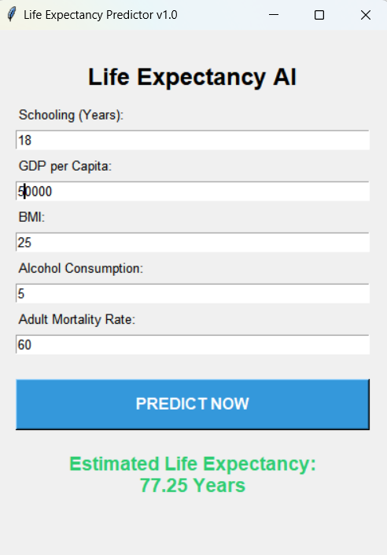
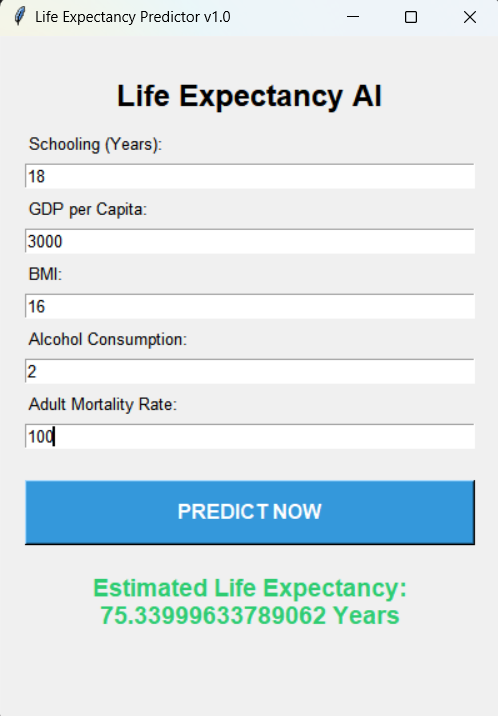
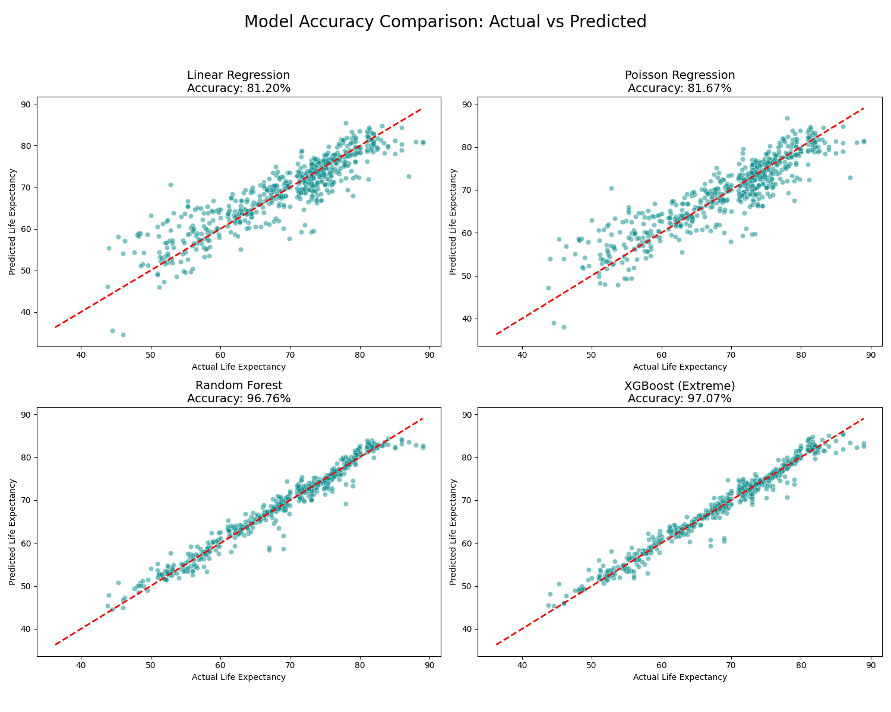
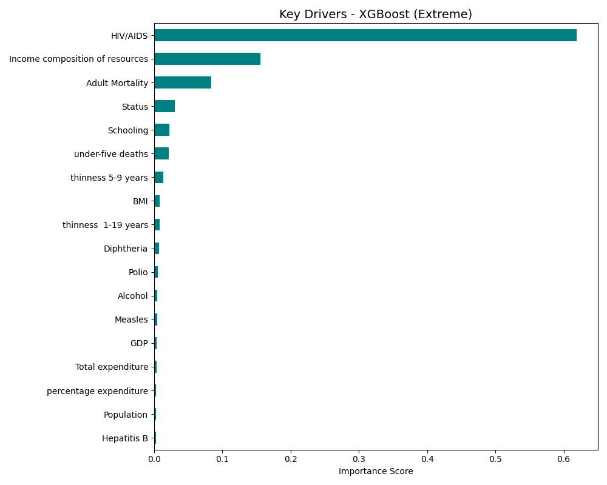
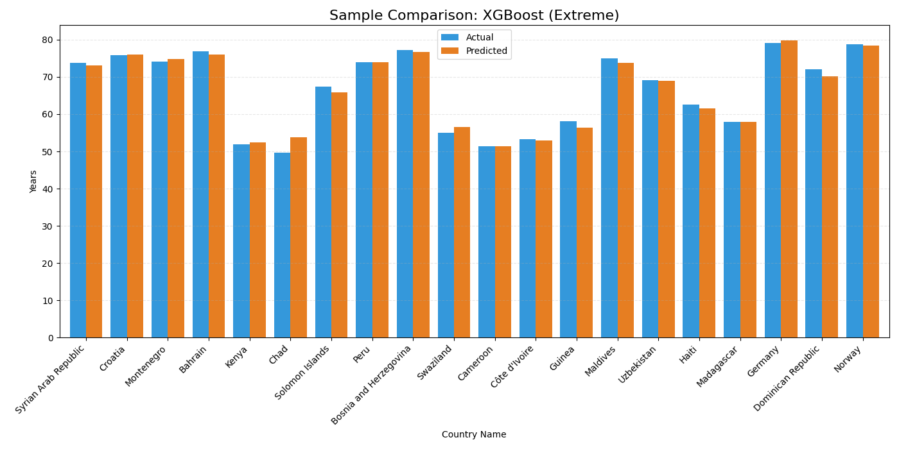

🌍 Life Expectancy Intelligence: End-to-End ML Pipeline

    
 
 A production-ready machine learning project for predicting life expectancy using global socio-economic and health indicators. 

📌 Project Overview

This project is an end-to-end machine learning solution designed to predict life expectancy from global socio-economic and health-related features.
The pipeline begins with data cleaning and exploratory data analysis, followed by feature preparation, model benchmarking, hyperparameter tuning, and final deployment as a desktop GUI application.

The final model uses an optimized XGBoost Regressor and achieves an R² score of 97.07%, making it a strong example of a real-world, production-oriented ML workflow.

📱 Final Product: Desktop GUI

The final deliverable is a functional desktop application built using Tkinter.
Users can enter key health and socio-economic parameters and instantly receive life expectancy predictions.

  
 
 <b>High-Resource Scenario</b> — Accurate predictions for high-GDP regions. 
 
  
 
 <b>Low-Resource Scenario</b> — Robust handling of varying health indicators. 

📊 1. Exploratory Data Analysis (EDA)

Before modeling, the dataset was carefully cleaned and prepared to improve model quality and reliability.

Key preprocessing steps:
Feature removal: Dropped infant deaths, Country, and Year to avoid redundancy and overfitting to identity-based patterns.
Missing value handling: Applied median imputation to preserve data integrity without discarding useful records.
Feature scaling: Used StandardScaler to normalize numeric inputs and ensure fair model learning across variables with different ranges.

This stage ensured that the model learned meaningful global health patterns rather than dataset-specific noise.

🧠 2. Machine Learning Engine

The core prediction engine is built around an optimized XGBoost Regressor.

Hyperparameter tuning

To improve performance beyond default settings, the following values were selected:

n_estimators = 500
Allowed more boosting rounds to correct residual errors.
learning_rate = 0.05
Kept learning gradual and stable to reduce overfitting.
max_depth = 6
Balanced model complexity and generalization.
Robust evaluation

Cross-validation logic was used to make the results more trustworthy and less dependent on a single train-test split.
This helped validate that the model performs consistently across different subsets of the data.

📈 3. Model Comparison & Benchmarking

Multiple models were benchmarked to justify the choice of XGBoost.

  

Model	R² Score
Linear Regression	81.20%
Poisson Regression	81.67%
Random Forest	96.76%
XGBoost	97.07%

The ensemble models clearly outperformed the linear baselines, with XGBoost achieving the best overall performance.

🔎 4. Key Drivers & Generalization
Feature importance

By analyzing feature importance, the project identified the strongest drivers of life expectancy prediction.

  

The top predictors included:

HIV/AIDS prevalence
Income composition of resources

These features had the largest influence on the final predictions.

Actual vs Predicted comparison

To test reliability on real historical cases, predictions were compared against actual values for 20 countries.

  

The predicted values closely match the actual trends, showing that the model generalizes well across countries and resource levels.

🛠️ Requirements & Installation
Libraries used
pandas
numpy
scikit-learn
xgboost
matplotlib
seaborn
joblib
tkinter
Installation

Clone the repository:

git clone https://github.com/your-username/Life-Expectancy-AI.git

Install required libraries:

pip install -r requirements.txt

Run the application:

python app.py
📂 Project Structure
├── Life_Expectancy_Data.csv    # Source dataset
├── model_training.py           # EDA, tuning, and benchmarking
├── app.py                      # Tkinter GUI application
├── life_model.pkl              # Trained XGBoost model
├── scaler.pkl                  # Fitted StandardScaler
├── medians.pkl                 # Stored medians for app imputation
├── feature_names.pkl           # Ordered list of features
└── README.md                   # Project documentation
🏆 Conclusion

This project demonstrates how feature engineering, hyperparameter tuning, and ensemble learning can produce a highly accurate and practical machine learning system for life expectancy prediction.

It is not just a training script — it is a complete AI product with:

data preprocessing
model benchmarking
tuned regression pipeline
feature interpretation
desktop deployment

The project highlights the ability to build a full ML workflow from raw data to a usable application, which is highly relevant for real-world AI and data science roles.

👨‍💻 Author

Ganesh Dilip Deshmukh
M.Tech in Robotics & Artificial Intelligence
Mechanical Engineering Background
Python | ML | Robotics | MATLAB | Data Science
